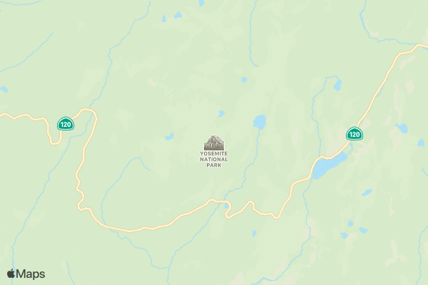
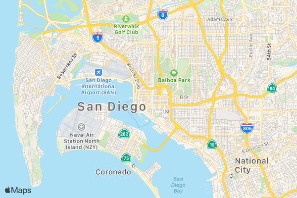
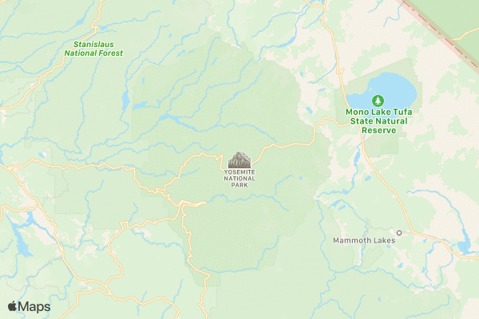
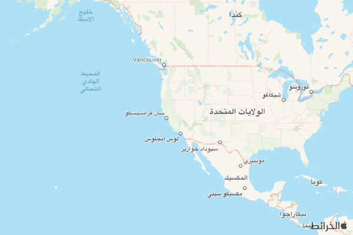
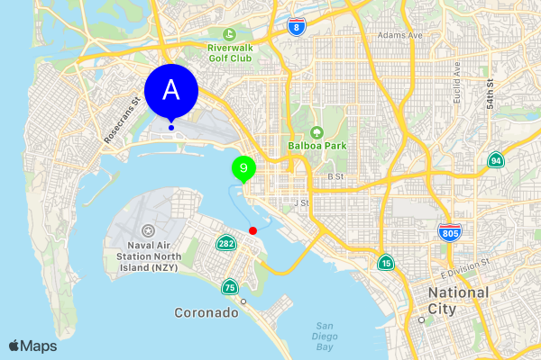
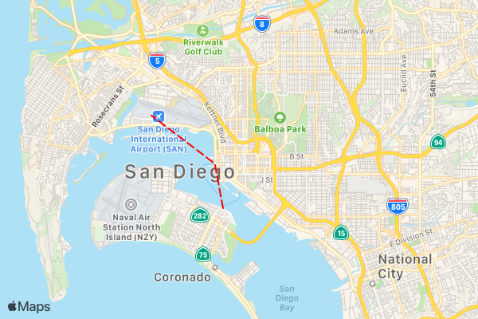

# Maps Web Snapshot

At WWDC 2019, Apple announced Maps Web Snapshots for creating a static map from a URL.  

* https://developer.apple.com/documentation/snapshots
* Web service endpoint  — https://developer.apple.com/documentation/snapshots/create_a_maps_web_snapshot


## Usage

Generate a URL to display a map from a Apple Maps Web Snapshot.  

Find the source code at [roblabs/apple-maps-web-snapshot-cli](https://github.com/roblabs/apple-maps-web-snapshot-cli)

See the sample GeoJSON, `null-island.geojson` for example valid properties

``` Javascript
"properties": {
  "center": [20, 20],
  "display_point": {
    "type": "Point","coordinates": [10,10]
  },
  "z": 2,
  "spn": [1.0, 1.0],
  "size": [600, 400],
  "scale": 1,
  "t": "mutedStandard",
  "colorScheme": "dark",
  "poi": 1,
  "lang": "en-US",
  "annotations": [],
  "overlays": [],
  "referer": "",
  "expires": 3155673601
}
```

---

``` bash

# update your credentials in `config.json` then install and run

# config.json
{
  "privateKey": "AuthKey_XXXXXXXXXX.p8",
  "teamId": "XXXXXXXXXX",
  "keyId":  "YYYYYYYYYY"
}

# install
npm install

# run and inspect output
# MapKit JS
mapkit-snapshots.js null-island.geojson -c config.json
```


## Apple MapKit JS Examples

This repo shows working samples of Maps Web Snapshots and Node JS sample code for generating the proper URLs to use in your applications.

| Snapshot Parameters or Documenation from [Create a Maps Web Snapshot](https://developer.apple.com/documentation/snapshots/create_a_maps_web_snapshot#center) |  Parameter examples|
| :------------- | :------------- |
| **`center`** - The center of the map. You can specify center as coordinates or as an address.  |   |
|   |  [signIt(\"center=0,0\")](https://snapshot.apple-mapkit.com/api/v1/snapshot?center=0,0&teamId=J7V35W7ES8&keyId=VKGGG3L5BX&signature=_CQvIG7iQGN-0tiyqXAOBbjt0tInsepLNbCeO8sbhkdS7VLf2hDCdiQluSRTfmVcWLzABiqeK96YqgH2qYYOgA) |
|   |  [signIt(\"center=37.839622,-119.515182\")](https://snapshot.apple-mapkit.com/api/v1/snapshot?center=37.839622,-119.515182&teamId=J7V35W7ES8&keyId=VKGGG3L5BX&signature=vBLwprXb_BKv417xNjPFYtsVlwAO1jM_ywxa7AR5MoinYyMaWa3doXu9KD0kiDeUdx8bvFGavXggeFwKSlGKxA) |
|   |  [signIt(\"center=San%20Diego,%20California\")](https://snapshot.apple-mapkit.com/api/v1/snapshot?center=San%20Diego,%20California&teamId=J7V35W7ES8&keyId=VKGGG3L5BX&signature=t76FXl_bIIv9s9LabHtorewlx9UMDvsrCAo0UeSCKKUyKFjg3IhDu6n3ApaDrwwKj-86ANk1GjpDHSuE8Oh5jA) |
| **`size & scale`** - `size` - The width and height must be within the range of [50, 640]. Default: 600x400. `scale` - The pixel density of the image. scale=2 returns an image intended for 2× Retina displays. |  |
|   |  [signIt(\"center=San%20Diego,%20California&scale=1\")](https://snapshot.apple-mapkit.com/api/v1/snapshot?center=San%20Diego,%20California&scale=1&teamId=J7V35W7ES8&keyId=VKGGG3L5BX&signature=YA-Wzqp3VDrrT1nqkbY_l63-NqGXKtNIG8mJFqIq_2-lcaGW6qvfIX7Bk1xAsOdTSgu7i1o9KV6tSj-DFx4Hyg) |
|   |  [signIt(\"center=San%20Diego,%20California&scale=2\")](https://snapshot.apple-mapkit.com/api/v1/snapshot?center=San%20Diego,%20California&scale=2&teamId=J7V35W7ES8&keyId=VKGGG3L5BX&signature=Cb9io7vYYAKK-VRkw7LHGfMUsfUSEIMMZHcl8TryR7JiAYimt6eZliS7vVR0xygB5EWhysfKnIEBImbNUF1imA) |
| **`t`** - The map type.  Possible values: standard, hybrid, satellite, mutedStandard | 
|   |  [signIt(\"center=37.839622,-119.515182&t=standard\")](https://snapshot.apple-mapkit.com/api/v1/snapshot?center=37.839622,-119.515182&t=standard&teamId=J7V35W7ES8&keyId=VKGGG3L5BX&signature=mz4a82aYZSa9tif0xNk6Y1FPc6qgd0wLoeFpHoz7AG3cdrwjQNRiqDaPCEgeWUAl2R_NeMGOc9pHPNqLxfrNeA) |
|   |  [signIt(\"center=37.839622,-119.515182&t=hybrid\")](https://snapshot.apple-mapkit.com/api/v1/snapshot?center=37.839622,-119.515182&t=hybrid&teamId=J7V35W7ES8&keyId=VKGGG3L5BX&signature=PUr_jizu7C0UcZ_ZQgUiZJ7ou-ZKEIOIFCvrt-Rn6BKxeyNdILowtXSpOtn6P90B8bw_XEO5iJoiewJYzdaqwA) |
|   |  [signIt(\"center=37.839622,-119.515182&t=satellite\")](https://snapshot.apple-mapkit.com/api/v1/snapshot?center=37.839622,-119.515182&t=satellite&teamId=J7V35W7ES8&keyId=VKGGG3L5BX&signature=oIjW35TikDHnTbmDQ_3IhBqiurI6hqWKxAkNlvvXMi8O6_FhrxM_-tOUEpa3-9mqVo5dbgCbBi4dRvu7ZrKNeg) |
|   |  [signIt(\"center=37.839622,-119.515182&t=mutedStandard\")](https://snapshot.apple-mapkit.com/api/v1/snapshot?center=37.839622,-119.515182&t=mutedStandard&teamId=J7V35W7ES8&keyId=VKGGG3L5BX&signature=5S5WmubPUfHWeSC8zgAQBYR3jAAx6p9DRYnagOMzx9xJZxB-JoMMhvGaE2yDppb2SU0UY2iGeJuA7efuSfg6AA) |
|   |  [signIt(\"center=San%20Diego,%20California&t=standard\")](https://snapshot.apple-mapkit.com/api/v1/snapshot?center=San%20Diego,%20California&t=standard&teamId=J7V35W7ES8&keyId=VKGGG3L5BX&signature=lPSdzn6czRvKWg1AxJQ30n2B5fUha4sh0VP2zcLuC9Imt6Mrc-AD6DA7Nrc8XoptHiZ4VDH3FF5LM4qrayiBzQ) |
|   |  [signIt(\"center=San%20Diego,%20California&t=hybrid\")](https://snapshot.apple-mapkit.com/api/v1/snapshot?center=San%20Diego,%20California&t=hybrid&teamId=J7V35W7ES8&keyId=VKGGG3L5BX&signature=H4A4thBAWFrvgX8GuovdPlmjy_3DSnItX4MsSYBdvmo96OymSbK2gAuEjEzwNv0l0Xj6CI1UbMxqfCtUc41OxQ) |
|   |  [signIt(\"center=San%20Diego,%20California&t=satellite\")](https://snapshot.apple-mapkit.com/api/v1/snapshot?center=San%20Diego,%20California&t=satellite&teamId=J7V35W7ES8&keyId=VKGGG3L5BX&signature=7FGJ1JjkSohegbrN5Rrh84A3kBSusbaXWZvmLITKOH3dqKZNIKmTJVONOR5gy7yMuDgiDVS-fxXF-LwTDICkEw) |
|   |  [signIt(\"center=San%20Diego,%20California&t=mutedStandard\")](https://snapshot.apple-mapkit.com/api/v1/snapshot?center=San%20Diego,%20California&t=mutedStandard&teamId=J7V35W7ES8&keyId=VKGGG3L5BX&signature=ydxvw2A_-12_6GyMr8tveiDwD69UF0fY3bHYnGppF413kYNir0RUFxsJ6_WPz47YXe1VkOvtXcAHTthF5Kwccg) |
| **`colorScheme`** - The color scheme of the map.  Possible values: light, dark. The dark color scheme only applies to the `standard` and `mutedStandard` map types. | 
|   |  [signIt(\"center=San%20Diego,%20California&t=standard&colorScheme=light\")](https://snapshot.apple-mapkit.com/api/v1/snapshot?center=San%20Diego,%20California&t=standard&colorScheme=light&teamId=J7V35W7ES8&keyId=VKGGG3L5BX&signature=VcNbRE3kHLrshJaSe6yTKjECAyUFRe9YZpHvmbUAKkvhUAtzGOXXaoxk0prTvaC-1F-RmaHbl4n3UNqg_Z12LA) |
|   |  [signIt(\"center=San%20Diego,%20California&t=standard&colorScheme=dark\")](https://snapshot.apple-mapkit.com/api/v1/snapshot?center=San%20Diego,%20California&t=standard&colorScheme=dark&teamId=J7V35W7ES8&keyId=VKGGG3L5BX&signature=crD96c6VOA8XyvuYAi9l1j8rvcbPBQrU7WmPbIvuK4GZqUqnalgvx3oaQ_elVe6oot60JDBDTTIocB5yCSrv3A) |
|   |  [signIt(\"center=San%20Diego,%20California&t=mutedStandard&colorScheme=light\")](https://snapshot.apple-mapkit.com/api/v1/snapshot?center=San%20Diego,%20California&t=mutedStandard&colorScheme=light&teamId=J7V35W7ES8&keyId=VKGGG3L5BX&signature=JYPWEYfCTL_AAsaQuuNjbzgnviTJTRH7dUXede05l2ON2Taijnt_c_8YXlYhLOVbKtTZooWNlyuLQ1iNAzIy4g) |
|   |  [signIt(\"center=San%20Diego,%20California&t=mutedStandard&colorScheme=dark\")](https://snapshot.apple-mapkit.com/api/v1/snapshot?center=San%20Diego,%20California&t=mutedStandard&colorScheme=dark&teamId=J7V35W7ES8&keyId=VKGGG3L5BX&signature=opuNjPhzMb06ESlXf94STjHcZnB1za9CwaG1BsUQgdx1JhyeU3T4mpatqAD1Qi8d5KT3ncGc_onEVZnjflK1Yw) |
| **`z`** - The zoom level of the map.  | 
|   |  [signIt(\"center=37.839622,-119.515182&z=15\")](https://snapshot.apple-mapkit.com/api/v1/snapshot?center=37.839622,-119.515182&z=15&teamId=J7V35W7ES8&keyId=VKGGG3L5BX&signature=pUUoZ7mIon70G4Xa3TrpcK_5un_waTXOxezS8u9qywHHcxmhjAZpRyUjZ-SsaJ05-GSWVZX9UgNOvMf1Ba9T2A) |
|   |  [signIt(\"center=37.839622,-119.515182&z=14\")](https://snapshot.apple-mapkit.com/api/v1/snapshot?center=37.839622,-119.515182&z=14&teamId=J7V35W7ES8&keyId=VKGGG3L5BX&signature=XrL4G6wNunFeLYfuV_dQ89pcyqihOtYw5dWn4ESiUEvHoTiptaWzdV7Abi0gR-EK3Vn43gWaBJoii3UNQ5gccA) |
|   |  [signIt(\"center=37.839622,-119.515182&z=13\")](https://snapshot.apple-mapkit.com/api/v1/snapshot?center=37.839622,-119.515182&z=13&teamId=J7V35W7ES8&keyId=VKGGG3L5BX&signature=YmwpwvEkwDyeotXx__ogs1JOoULIbMIQjoqYX8Ix9lvDhW5f8fNU4hIr13ZbQ0dUar4fw7Mx5peVw75YwKDyAA) |
|   |  [signIt(\"center=37.839622,-119.515182&z=12\")](https://snapshot.apple-mapkit.com/api/v1/snapshot?center=37.839622,-119.515182&z=12&teamId=J7V35W7ES8&keyId=VKGGG3L5BX&signature=Vkj5glB1WeGztGobS_5EIvIxEQi2DHQXytVDHvA3IEfqoqIlLIicl-9O84vrswsKAqQVmnRUDOGw6n-H9CjKyg) |
|   |  [signIt(\"center=37.839622,-119.515182&z=11\")](https://snapshot.apple-mapkit.com/api/v1/snapshot?center=37.839622,-119.515182&z=11&teamId=J7V35W7ES8&keyId=VKGGG3L5BX&signature=d9C5kBKjmR5xEy14OQXobUtZbMpsCcf_voWk5M_JDsegKVU6Idg5O4iDqz_AX_zRwxM-cBekS3FfRhYL-Nz6oQ) |
|   |  [signIt(\"center=37.839622,-119.515182&z=10\")](https://snapshot.apple-mapkit.com/api/v1/snapshot?center=37.839622,-119.515182&z=10&teamId=J7V35W7ES8&keyId=VKGGG3L5BX&signature=CZ90uXzEFPTEf8N2jtJoJY80okgf4dzQFIskMS1xRvQabdl3zx-Ut0aQdrz_RBgyu0BlpQJEoJL0T8nP_NG7ug) |
|   |  [signIt(\"center=37.839622,-119.515182&z=9\")](https://snapshot.apple-mapkit.com/api/v1/snapshot?center=37.839622,-119.515182&z=9&teamId=J7V35W7ES8&keyId=VKGGG3L5BX&signature=7OAiv1VSLhwkYEjsfLwEKh_uDFLJGrpdqUJnDBzRQL6qCerfLwlUk9R2BsCF6Kl9kdcxKyGu7Vf3FazULXqdgQ) |
| **`poi`** - A Boolean value indicating whether points of interest are shown on the map.  |  |
|   |  [signIt(\"center=San%20Francisco,%20California&t=mutedStandard&poi=0\")](https://snapshot.apple-mapkit.com/api/v1/snapshot?center=San%20Francisco,%20California&t=mutedStandard&poi=0&teamId=J7V35W7ES8&keyId=VKGGG3L5BX&signature=2Xu7FoCPZgcg2HnHwBVpaCvUnxIFp0aR3mzxCDjtrlPv3D4nM48gS4AaDoq4hWEoVIOdLv7CKA7TdvoTRJGclA) |
|   |  [signIt(\"center=San%20Francisco,%20California&t=mutedStandard&poi=1\")](https://snapshot.apple-mapkit.com/api/v1/snapshot?center=San%20Francisco,%20California&t=mutedStandard&poi=1&teamId=J7V35W7ES8&keyId=VKGGG3L5BX&signature=yZyRYiWZQNYLQ9SKXIpNjArUYoVYKGvQhD8unThM8_TbagdAyE_Ik3p2CYbApYFCNw4Cw6eRqZkmAp9LQlQAzA) |
| **`lang`** - The language to be used for labels on the map, Supported values are in [locale IDs](https://developer.apple.com/library/archive/documentation/MacOSX/Conceptual/BPInternational/LanguageandLocaleIDs/LanguageandLocaleIDs.html), such as en-GB or es-MX. | 
|   |  [signIt(\"center=37.839622,-119.515182&z=3&lang=ar-AR\")](https://snapshot.apple-mapkit.com/api/v1/snapshot?center=37.839622,-119.515182&z=3&lang=ar-AR&teamId=J7V35W7ES8&keyId=VKGGG3L5BX&signature=EfCgPO0IF1sAuhV7tTSkDHGnkLFdlxPPntOgqi1PFgnibbRZc-MvPumLTPfJNKJA99hcPHZ2Ri_zDAYyzEw5oA) |
|   |  [signIt(\"center=37.839622,-119.515182&z=3&lang=de-DE\")](https://snapshot.apple-mapkit.com/api/v1/snapshot?center=37.839622,-119.515182&z=3&lang=de-DE&teamId=J7V35W7ES8&keyId=VKGGG3L5BX&signature=v0fcIINKQiGtBSU_Hps_gIAxE3uBmZbi29HfVfbJN7GPuDEeTsjvW-SvkUQmneTijYSL3qTm_i8AtpI0oT54vg) |
|   |  [signIt(\"center=37.839622,-119.515182&z=3&lang=en-US\")](https://snapshot.apple-mapkit.com/api/v1/snapshot?center=37.839622,-119.515182&z=3&lang=en-US&teamId=J7V35W7ES8&keyId=VKGGG3L5BX&signature=VlYwE5qXxEFzeKULfxGxgwgzjK9PJz9O8LsXjbizU_sb1fmQrbRYoOknyVzSV2gbq9LvSRYXnbfc_sKuLv54HA) |
|   |  [signIt(\"center=37.839622,-119.515182&z=3&lang=es-MX\")](https://snapshot.apple-mapkit.com/api/v1/snapshot?center=37.839622,-119.515182&z=3&lang=es-MX&teamId=J7V35W7ES8&keyId=VKGGG3L5BX&signature=1-970l0FuwTPZgXoTsGfGkhrjjUzY-mxLgGOeGwqIbjYz65FEoIf4p1Tu43aVxTb6gvGVx5QnAnAPK-QWEVwDg) |
|   |  [signIt(\"center=37.839622,-119.515182&z=3&lang=es-ES\")](https://snapshot.apple-mapkit.com/api/v1/snapshot?center=37.839622,-119.515182&z=3&lang=es-ES&teamId=J7V35W7ES8&keyId=VKGGG3L5BX&signature=LRlNKCRxFB_n-xg8UwZIRc0F8t8n8Ck0Pec3Pz9FmT29HBiX9CbcdVM-Wb0DJBjO2Ta6V8BHrkjkDJPkhWT4nQ) |
|   |  [signIt(\"center=37.839622,-119.515182&z=3&lang=el-GR\")](https://snapshot.apple-mapkit.com/api/v1/snapshot?center=37.839622,-119.515182&z=3&lang=el-GR&teamId=J7V35W7ES8&keyId=VKGGG3L5BX&signature=WUSOf-HW7jPvbv-BV10gpSYxlQ8hOkiV-PKEz_ECXDDzC8UDpBfm6GrFjCr4mUrrizlgws8-Ndh0rOZDUYnQWw) |
|   |  [signIt(\"center=37.839622,-119.515182&z=3&lang=fi-FI\")](https://snapshot.apple-mapkit.com/api/v1/snapshot?center=37.839622,-119.515182&z=3&lang=fi-FI&teamId=J7V35W7ES8&keyId=VKGGG3L5BX&signature=pIA_QZJZGpbIgkaMtcjLUnOrgCI53qFh5oXrn8IAtVuJ6mjOa1P7Yc0bu50BaHDkIvvGqDiQr1bB1dGjDKIrnQ) |
|   |  [signIt(\"center=37.839622,-119.515182&z=3&lang=fr-FR\")](https://snapshot.apple-mapkit.com/api/v1/snapshot?center=37.839622,-119.515182&z=3&lang=fr-FR&teamId=J7V35W7ES8&keyId=VKGGG3L5BX&signature=jA0v_xwMe8NUOTj9dsrQc9Z6USGhekatKsqxoaPVP-X2Go_QIKJnCgcUESWR5Sd9cEywW7uC8GM6nZaMmZiMWQ) |
|   |  [signIt(\"center=37.839622,-119.515182&z=3&lang=ja-JA\")](https://snapshot.apple-mapkit.com/api/v1/snapshot?center=37.839622,-119.515182&z=3&lang=ja-JA&teamId=J7V35W7ES8&keyId=VKGGG3L5BX&signature=yB0WRehXzOyQMfaCpZ8J2nGmSc484NDE9IO1OU4etcsbHmPHtoPh7Be_OdqdvJdhmflvwktX_jFZXTe2wJMbVw) |
|   |  [signIt(\"center=37.839622,-119.515182&z=3&lang=hu-HU\")](https://snapshot.apple-mapkit.com/api/v1/snapshot?center=37.839622,-119.515182&z=3&lang=hu-HU&teamId=J7V35W7ES8&keyId=VKGGG3L5BX&signature=Rck8se1DVokC0COyUj3unZQ5BybSensLM2Ku9rsuBfwzZKfN1CaR5szSA6qKH1Jrjpm0mDqQAjz_17Nf9-w5Vg) |
|   |  [signIt(\"center=37.839622,-119.515182&z=3&lang=it-IT\")](https://snapshot.apple-mapkit.com/api/v1/snapshot?center=37.839622,-119.515182&z=3&lang=it-IT&teamId=J7V35W7ES8&keyId=VKGGG3L5BX&signature=Y71gWPLRd5ONKYg2qRRxQAa3y4kSvPWN_0gL59R1E_XCKS7KglGJPobtMwj2lS9Pd0SFxwIv-HbfpvDuBuJqEg) |
|   |  [signIt(\"center=37.839622,-119.515182&z=3&lang=ko-KO\")](https://snapshot.apple-mapkit.com/api/v1/snapshot?center=37.839622,-119.515182&z=3&lang=ko-KO&teamId=J7V35W7ES8&keyId=VKGGG3L5BX&signature=k-h1YNcqH-DzrvwIEOpRV_-W3UattFI0xKlVJzToh8QL0dN80wh8ZZ3cHdhMb1Mk6nmS17xVVCQzayXmmvJh8Q) |
|   |  [signIt(\"center=37.839622,-119.515182&z=3&lang=nl-NL\")](https://snapshot.apple-mapkit.com/api/v1/snapshot?center=37.839622,-119.515182&z=3&lang=nl-NL&teamId=J7V35W7ES8&keyId=VKGGG3L5BX&signature=wKO6OxuTaDvujS7jEdBCwNwZ04Q_U5G5s3iZu3-XnY9hiWRgJKGkaQQJLffRr5dHBAat0-SpL4A6uk4Ab_6BTQ) |
|   |  [signIt(\"center=37.839622,-119.515182&z=3&lang=no-NO\")](https://snapshot.apple-mapkit.com/api/v1/snapshot?center=37.839622,-119.515182&z=3&lang=no-NO&teamId=J7V35W7ES8&keyId=VKGGG3L5BX&signature=ZisQEbZZOZhcvFWli8sl7iODwOoMyqcauHerUxd-GQibns_DEMJjuWeczEbBVtjGxFuL9pxUDzOPnAtRSHU3Mw) |
|   |  [signIt(\"center=37.839622,-119.515182&z=3&lang=he-HE\")](https://snapshot.apple-mapkit.com/api/v1/snapshot?center=37.839622,-119.515182&z=3&lang=he-HE&teamId=J7V35W7ES8&keyId=VKGGG3L5BX&signature=SOH5qn-tVgIF6l_jJQYcCpIqeCTZ6yDuaf60ja0FdmGtktPxWkksHDVfo2jYJo470Xqvj3ytft_UzIFIFGSF_A) |
|   |  [signIt(\"center=37.839622,-119.515182&z=3&lang=hi-IN\")](https://snapshot.apple-mapkit.com/api/v1/snapshot?center=37.839622,-119.515182&z=3&lang=hi-IN&teamId=J7V35W7ES8&keyId=VKGGG3L5BX&signature=J9uPvzKUAzZt66b4BKq6fxa_liDQcLyzzerS9ErbD0Vag_F25SW230py99QXerzL1am32FgdxtlQv7CCv5lLcQ) |
|   |  [signIt(\"center=37.839622,-119.515182&z=3&lang=pt-BR\")](https://snapshot.apple-mapkit.com/api/v1/snapshot?center=37.839622,-119.515182&z=3&lang=pt-BR&teamId=J7V35W7ES8&keyId=VKGGG3L5BX&signature=jaJ0Tk5ShePZGccsoG8_Sn6QoTDdLmqu8AQtDVLw10OQIEAVSrw6F_iXWRrTD1it87lH8lOvmxmpcshON4g82Q) |
|   |  [signIt(\"center=37.839622,-119.515182&z=3&lang=ru-RU\")](https://snapshot.apple-mapkit.com/api/v1/snapshot?center=37.839622,-119.515182&z=3&lang=ru-RU&teamId=J7V35W7ES8&keyId=VKGGG3L5BX&signature=h363-j7Sux1LQx3FVQIdw22HXDAaAPSX4kIYsRN7V3UDFS3XmFt2inENkCk-eGO4Hvdyo_m9k_Dx73oGvxMz1A) |
|   |  [signIt(\"center=37.839622,-119.515182&z=3&lang=tr-TR\")](https://snapshot.apple-mapkit.com/api/v1/snapshot?center=37.839622,-119.515182&z=3&lang=tr-TR&teamId=J7V35W7ES8&keyId=VKGGG3L5BX&signature=jnJpJgHZiOWWV2YXguwdkr65NVbZhKnoX-8mmMZ9uk5wtLgOvzwyySEwv8sNZc9gIjSi1ljS7TEBNvySyBoBrw) |
|   |  [signIt(\"center=37.839622,-119.515182&z=3&lang=vi-VI\")](https://snapshot.apple-mapkit.com/api/v1/snapshot?center=37.839622,-119.515182&z=3&lang=vi-VI&teamId=J7V35W7ES8&keyId=VKGGG3L5BX&signature=NEv093MrQJBfcdEQCU8nMVfsqjvI6rnb4b2LEbBebyEAJYN5XOZSCXk1x9bTj5WaCc6_y0AUFyAkdmvMs1gbXQ) |
|   |  [signIt(\"center=37.839622,-119.515182&z=3&lang=zh-ZH\")](https://snapshot.apple-mapkit.com/api/v1/snapshot?center=37.839622,-119.515182&z=3&lang=zh-ZH&teamId=J7V35W7ES8&keyId=VKGGG3L5BX&signature=L6tZdfL4x-0oOQUJyABERtmIrY6Xoh-_VnNnLuyZRDLdkiYrXl8a8sL8gzJalAnDF1o9ZBQYVylrZyCdT3WcIA) |
| **`annotations`** - Example of [Annotations](https://developer.apple.com/documentation/snapshots/annotation) .  The array of JSON Annotation, which draws 3 points: a red `dot`, a green `balloon`, & blue `large` annotations, is shown `[{"point":"32.73,-117.19", "color":"blue",  "glyphText":"A", "markerStyle":"large"},` <br> `{"point":"32.71,-117.17", "color":"00ff00","glyphText":"9", "markerStyle":"balloon"},` <br> `{"point":"32.69,-117.16", "color":"red",   "glyphText":"a", "markerStyle":"dot"}` <br> `]` |  |
| Live example of Annotations |  [signIt(\"center=San%20Diego,%20California&\<urlEncoded Annotations\>\")](https://snapshot.apple-mapkit.com/api/v1/snapshot?center=San%20Diego,%20California&annotations=%5B%7B%22point%22%3A%2232.732373%2C-117.197503%22%2C%22color%22%3A%22blue%22%2C%22glyphText%22%3A%22A%22%2C%22markerStyle%22%3A%22large%22%7D%2C%7B%22point%22%3A%2232.715104%2C-117.174038%22%2C%22color%22%3A%2200ff00%22%2C%22glyphText%22%3A%229%22%2C%22markerStyle%22%3A%22balloon%22%7D%2C%7B%22point%22%3A%2232.699945%2C-117.169792%22%2C%22color%22%3A%22red%22%2C%22glyphText%22%3A%22a%22%2C%22markerStyle%22%3A%22dot%22%7D%5D&teamId=J7V35W7ES8&keyId=VKGGG3L5BX&signature=ZGhh0aC2Gx-2TPpt3ZAHzO2t-3MA5hcax6x3ZLzPdFNg0clr6rTGofG6TDNWe5TDZQH4sZyC8HP73df5GPn9SQ) |
| **`overlays`** - Example of [Overlays](https://developer.apple.com/documentation/snapshots/overlay).    The array of JSON `Overlay` objects, which draws a red dashed line over 3 points, is shown:<br> `[{"points":["32.73,-117.19","32.71,-117.17","32.69,-117.16"],`<br>`"strokeColor":"ff0000","lineWidth":2,"lineDash":[10,5]}`<br>`]`  |  |
|  Live example of Overlays |  [signIt(\"center=San%20Diego,%20California&\<urlEncoded Overlay\>\")](https://snapshot.apple-mapkit.com/api/v1/snapshot?center=San%20Diego,%20California&overlays=%5B%7B%22points%22%3A%5B%2232.732373%2C-117.197503%22%2C%2232.715104%2C-117.174038%22%2C%2232.699945%2C-117.169792%22%5D%2C%22strokeColor%22%3A%22ff0000%22%2C%22lineWidth%22%3A2%2C%22lineDash%22%3A%5B10%2C5%5D%7D%5D&teamId=J7V35W7ES8&keyId=VKGGG3L5BX&signature=WYbdsjcE22KI8tCrxM0YJJdYFfNgsC58OlhpTatdszcC2o53A-EDW5J4XbsCxhdEv4jFy_DW3Rq19jCBAc7q6w) |
| Live example of Annotations & Overlays, together|  [signIt(\"center=San%20Diego,%20California&\<urlEncoded Annotation &  Overlay\>\")](https://snapshot.apple-mapkit.com/api/v1/snapshot?center=San%20Diego,%20California&annotations=%5B%7B%22point%22%3A%2232.732373%2C-117.197503%22%2C%22color%22%3A%22blue%22%2C%22glyphText%22%3A%22A%22%2C%22markerStyle%22%3A%22large%22%7D%2C%7B%22point%22%3A%2232.715104%2C-117.174038%22%2C%22color%22%3A%2200ff00%22%2C%22glyphText%22%3A%229%22%2C%22markerStyle%22%3A%22balloon%22%7D%2C%7B%22point%22%3A%2232.699945%2C-117.169792%22%2C%22color%22%3A%22red%22%2C%22glyphText%22%3A%22a%22%2C%22markerStyle%22%3A%22dot%22%7D%5D&overlays=%5B%7B%22points%22%3A%5B%2232.732373%2C-117.197503%22%2C%2232.715104%2C-117.174038%22%2C%2232.699945%2C-117.169792%22%5D%2C%22strokeColor%22%3A%22ff0000%22%2C%22lineWidth%22%3A2%2C%22lineDash%22%3A%5B10%2C5%5D%7D%5D&teamId=J7V35W7ES8&keyId=VKGGG3L5BX&signature=m9UAKoC0ShqSpMTHAvIlH2R3qFllvtDtJkchCHRYu6MB69MjsX09FNELsuD3jCegnkr1QV0JIsv5r9nhLlNzrw) |
